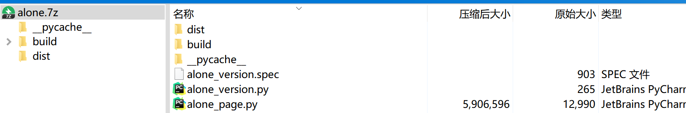
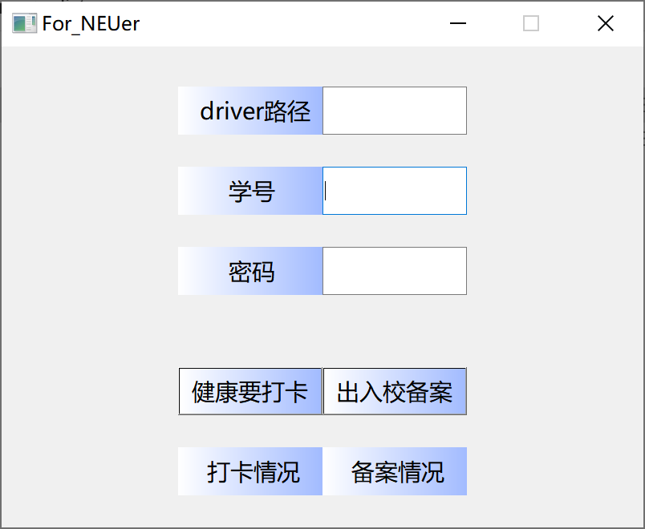

# automatic-check-in
With student_id and password, the script can check in / file automatically for NEU student.

# environment
Besides the packages displayed in code, it's necessary to download the webdriver for your browser

link for chrome:  https://chromedriver.chromium.org/downloads
(and move it to your browser's path, like C:/Program Files (x86)/Google/Chrome/Application/)

and then you get your driver_path, like C:/Program Files (x86)/Google/Chrome/Application/chromedriver.exe

# generate alone_version.exe
1. configure environment required
2. decompress alone.7z
3. enter cmd and run: pyinstaller -F -w alone_version.py
   then you get 
   (alone.7z in picture is not equal to the counterpart in the webpage)
4. Congratulations! you can run alone_version.exe in ./dist
   like 

# It's my pleasure to communicate with you in issues/email!
